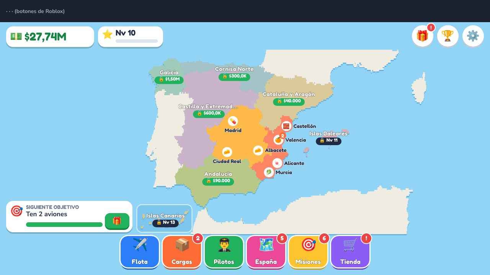

# AeroCarga España — Documento de diseño (v0.3)

> En inglés: *Spain Air Cargo Tycoon*. Nombre fácil de cambiar (textos en `Lang.luau`).

## 1. Idea

Tienes una avioneta en Madrid. Llevas los productos típicos de cada zona de España
(naranjas de Valencia, jamón de Salamanca, vino de Logroño, pescado de Vigo, plátanos de Canarias…),
compras aviones, fichas pilotos y **vas pintando el mapa de España con tus colores** al abrir regiones.
Todo es 2D: el mapa ocupa la pantalla y las ventanas se abren encima.

## 1 bis. Qué cambia en la v0.3 («le falta algo, es muy simple»)

**Diagnóstico** (auditoría del código + bot que juega 6 h):
- el dinero por segundo **no dependía del destino**: elegir carga era «pulsa la primera fila»;
- desde el nivel 5 el **despacho automático** hacía lo mismo que el jugador;
- en unas 2 h de bot **no quedaba nada que comprar** y no había meta a largo plazo;
- la ventana de CARGAS **tapaba el despegue** en el primer minuto.

**Inspiración** (investigación web): Pocket Planes (llenar aviones, eventos), Airline Manager 4 (precios que cambian,
motivos para volver), OpenTTD (subvenciones de rutas nuevas, demanda), Mini Metro (elegir), juegos idle con prestigio
(AdVenture Capitalist, Idle Miner) y Roblox (Grow a Garden: eventos para todo el servidor; Airport Tycoon: renacimiento).

| Sistema nuevo | Qué decisión crea | Dónde |
|---|---|---|
| **Demanda viva** | 4 ciudades «🔥 en auge» cada 10 min (×1,3–1,6, iguales en todos los servidores). Si repites destino, paga menos (−8 % por vuelo reciente, mínimo −40 %, se recupera en 90 s) | Mapa (insignias 🔥, anillo rojo si saturado) y etiquetas en CARGAS |
| **Eventos de España** | Cada 7 min: 5 min de evento (Fallas 🍊×2, San Fermín, Feria de Abril, vendimia, temporal en Galicia, niebla en Madrid…). Los de temporada salen 4× más en su mes real | Tarjeta morada arriba a la derecha y emoji en el mapa |
| **Contratos con empresas** (nv 3) | «Frutas del Turia: lleva 4 cargas de 🍊 a Cataluña en 16 min» → premio de varios minutos de ingresos. 2 a la vez | Botón 📜 de la barra; progreso arriba a la izquierda; cargas marcadas con 📜 |
| **Pilotos con rasgo** | Veloz, Ahorrador, Isleño, Frigorífico, Gourmet, Urgencias (se ve ANTES de ficharlo; no es sorteo de pago) | PILOTOS y el selector de CARGAS |
| **Aterrizaje perfecto** | Cuando vuelas TÚ: aguja en los últimos 4 s; verde +25 %, amarillo +10 %. Da sentido a volar en persona | Ventana sobre el mapa |
| **Chárter** (nv 2) | El avión se va 1, 4 u 8 horas reales y vuelve con 20, 60 o 110 min de tus ingresos. Uno a la vez, sin piloto | Botón 🌙 en CARGAS |
| **Pasaporte** | Sello por aeropuerto (la 1.ª entrega paga ×1,5) + medallas 🥉🥈🥇 por producto (1/10/50). Región completa: +3 % allí | ESPAÑA → Pasaporte |
| **Salir a bolsa** (nv 12) | Reinicia la partida a cambio de acciones (+20 % de pago y +25 % de XP cada una) y una ventaja fija por salida | Botón 🏛️ arriba a la derecha |
| **Tu aerolínea** | Nombre por piezas (sin texto libre) y color de tus aviones; los demás jugadores ven tus aviones en su mapa | AJUSTES |
| **Ranking semanal** | Se reinicia cada lunes: los nuevos pueden competir | 🏆 |
| **Sensación** | El despegue se ve (la ventana se cierra o pasa al siguiente avión), monedas que vuelan al contador, «N aviones esperando», ganancias por minuto, estrellas vacías en gris, «Reclamar todo» | HUD |

**El automático ya no es perfecto:** coge la carga con más beneficio, pero no persigue contratos ni hace aterrizajes
perfectos. Jugar a mano rinde más; dejarlo en automático sigue siendo cómodo.

## 2. Por qué ya no se parece al juego de camiones

| | Juego de referencia | AeroCarga España |
|---|---|---|
| Tema | Camiones por EE. UU. | Aviones de carga por España, con productos reales de cada zona |
| Aspecto | Oscuro (azul marino), letra condensada | Claro y soleado, letra redondeada, botones «gruesos» de juego para móvil |
| Estructura | Menú lateral y páginas que sustituyen la pantalla | Mapa siempre visible + barra inferior de 6 botones + ventanas encima |
| Mapa | Imagen de satélite oscura de EE. UU. | España dibujada con código por regiones que se colorean al abrirlas |
| Contratar | Agencias con barras de probabilidades (sorteo) | Candidatos a la vista: ves sus estrellas y su precio, **sin sorteo** |
| Vehículos | Fotos 3D de camiones | Aviones dibujados con código, con nombres de aves |
| Otros | Seguro, licencias, banco | Contratos exprés, misiones diarias, premio diario, objetivos, tutorial guiado |

Lo que comparten es el **género** (gestionar una empresa de transporte), y eso no tiene dueño.
No he copiado código, textos, nombres, imágenes ni la distribución de pantallas.
No soy abogado: es una valoración razonable, no un consejo legal (ver §8).

## 3. Bucle principal

1. **Cargas** → eliges avión → quién vuela (tú o un piloto) → carga → **VOLAR**.
2. El avión cruza el mapa (1 s real = 2 min de vuelo). Al aterrizar sube el dinero flotando.
3. Cobras: **pago − combustible − 10 % del piloto contratado**, y ganas XP.
4. Compras más aviones, fichas pilotos, abres regiones y mejoras la empresa.
5. Nivel 5: **despacho automático**. Con él activado tu flota también gana mientras no juegas (50 %, o 100 % con el pase).

Tú solo puedes llevar un avión a la vez: para volar varios hay que fichar pilotos.

## 4. Lo que engancha

| Sistema | Qué hace |
|---|---|
| **Tutorial guiado** (5 pasos) | Una capitana y una flecha 👇 te dicen qué pulsar: primer vuelo (15 s, bien pagado), comprar avión, fichar piloto y reclamar el primer objetivo. Regalos de $5.000 y $10.000. |
| **Objetivo siempre visible** | Tarjeta abajo a la izquierda con el siguiente objetivo y su barra; se reclama con un toque. 41 objetivos en cadena. |
| **Contratos exprés** ⚡ | Cada 1,5–2,5 min aparece uno dorado en un aeropuerto: paga ×2,5 y caduca en 80 s. Aviso, pulso en el mapa y botón IR. |
| **Misiones diarias** | 3 al día (fácil, media y difícil); completar las 3 da x2 de dinero durante 15 min. |
| **Premio diario** 🎁 | Racha de 7 días que crece; el día 7 da además x2 durante 30 min. |
| **Mapa que se colorea** | Cada región abierta se pinta de su color; las bloqueadas muestran nivel o precio. |
| **Pilotos que suben de nivel** | Ganan +1,5 % de pago por nivel al volar. Candidatos nuevos cada 4 min. |
| **Bienvenida de vuelta** | Te dice cuánto ganó tu flota mientras no estabas (con opción de duplicarlo con Robux). |
| **Celebraciones** | Subida de nivel con confeti y lista de lo desbloqueado; fichajes de 4–5★ con confeti. |
| **Social** | +10 % por cada amigo en el servidor (máx. 4), +10 % con Premium, botón de invitar, avisos a todo el servidor ("Fulano ha comprado un Cóndor"), ranking mundial. |

## 5. Economía (todo en `src/ReplicatedStorage/Config.luau`)

**Aviones**

| Avión | Carga | Velocidad | Alcance | Precio | Nivel |
|---|---|---|---|---|---|
| 🐦 Gorrión | 1 t | 320 km/h | 1.300 km | $20.000 | 1 |
| 🦅 Halcón | 3 t | 420 km/h | 1.800 km | $60.000 | 3 |
| 🕊️ Albatros | 8 t | 520 km/h | 2.600 km (llega a Canarias) | $250.000 | 6 |
| 🦩 Grulla | 16 t | 780 km/h | 3.000 km | $1,2M | 9 |
| 🦚 Cóndor | 30 t | 840 km/h | 4.500 km | $5M | 13 |
| 🐋 Ballena | 70 t | 800 km/h | 6.000 km | $20M | 18 |

**Pago** = toneladas × km × $8 × multiplicador del producto (📦 ×1 … 💊 ×1,8) × mejoras × bonus del piloto × bonus sociales/VIP/turbo.
**Regiones**: Madrid y Centro + Levante (gratis) · Cataluña y Aragón (nv 3, $40K) · Andalucía (nv 4, $90K) · Cornisa Norte (nv 6, $300K) ·
Castilla y Extremadura (nv 7, $600K) · Galicia (nv 9, $1,5M) · Baleares (nv 11, $3,5M) · Canarias (nv 13, $8M). 41 aeropuertos.
**Mejoras**: hangar (+2 aviones), equipo comercial (+5 % de pago), combustible (−5 %), carga rápida (−8 % de tiempo), cámara frigorífica (🐟 y 💊).
**Pilotos**: candidatos de 1 a 5★ (42/30/17/8/3 %); bonus 0/5/10/18/30 % + 1,5 % por nivel; precio según estrellas y tu nivel.

**Ritmo medido** (bot perfecto en `tools/check.sh`; una persona irá unas 2–3 veces más lenta):
nivel 2 ≈ 0,5 min · nivel 3 ≈ 2 min · nivel 5 ≈ 8 min · nivel 10 ≈ 19 min · **1.ª salida a bolsa ≈ 40–50 min**
(una persona: ≈ 1,5–2,5 h) · **2.ª partida: nivel 10 en ≈ 12–13 min** (1,6–2 veces más rápida).

**Bolsa:** acciones totales = ⌊√(ganado en toda la historia / 1 M)⌋; se cobran las que aún no tienes (mínimo 5 nuevas
y nivel 12). Ventajas por salida: 1) color oro + $300K al empezar · 2) empiezas con Cataluña y Aragón · 3) +1 contrato ·
4) un Halcón extra · 5) +1 candidato a piloto. Se conservan acciones, pasaporte, objetivos, aerolínea, pases y lo ganado.

**Premios que no se quedan pequeños:** misiones, objetivos y premio diario usan la mayor de dos cifras: la escala por
nivel de antes o 2 minutos de tus ingresos reales.

## 6. Monetización (preparada; falta crear los artículos y poner sus IDs)

Todo con Robux es opcional y **sin artículos aleatorios de pago** (así no hay que declarar "paid random items").

| Tipo | Artículo | Precio recomendado |
|---|---|---|
| Game Pass | 💰 VIP: dinero x2 | 199 R$ |
| Game Pass | 🤖 Piloto automático (auto desde nivel 1 + 100 % offline) | 149 R$ |
| Game Pass | 🏗️ Hangar XL (+5 aviones) | 99 R$ |
| Game Pass | 🚀 Motores turbo (vuelos −25 %) | 249 R$ |
| Producto | 🎁 Pack de inicio (Halcón + $50K + x2 30 min, una vez) | 99 R$ |
| Producto | 💵 Maletín / 💰 Maleta / 🏦 Caja fuerte (10 / 40 / 180 min de tus ingresos) | 25 / 79 / 249 R$ |
| Producto | ⚡ Turbo x2 (30 min) | 49 R$ |
| Producto | 🛬 Aterrizar todos ya | 19 R$ |
| Producto | ⭐ Piloto estrella (5★, sin sorteo) | 99 R$ |
| Producto | 🌙 Duplicar ganancias offline (sale al volver) | 29 R$ |

Son **4 pases y 8 productos** (en la v0.2 este documento decía 10 productos por error).
«Aterrizar todos» no afecta a los chárter. El piloto estrella trae siempre el rasgo fijo «As» (nada al azar).
Investigación de precios: juegos parecidos de Roblox cobran el x2 de dinero entre 329 y 650 R$; el VIP a 199 R$ quizá
se pueda subir a 299 R$ más adelante (confianza media).

Mientras un artículo tenga `id = 0` no aparece en el juego publicado; en Studio se ve como muestra.

## 7. Qué se ha verificado y qué no

**Verificado** (con `tools/check.sh`, sin Studio):
- 0 avisos del analizador con la API de Roblox, y 242 textos presentes en inglés y español.
- **Sin DataStore (como en Studio sin publicar)**: el juego funciona y avisa de que no guarda.
  Era la causa probable de que no vieras aviones ni pudieras fichar en la v0.1.
- Un bot juega 25 min de partida real, y se prueban salida/entrada con ganancias offline, compras con Robux simuladas y recibos repetidos.
- **Juego completo**: servidor e interfaz reales juntos. Se pulsa JUGAR, se hace el tutorial siguiendo la flecha, se abren todas las ventanas y pestañas,
  se pulsan más de 7.000 botones y se cambia de idioma.
- Vista previa aproximada en navegador (`docs/*.jpg`).
- **v0.3**: el bot cumple contratos, consigue sellos, sale a bolsa y mide la 2.ª partida; la prueba completa hace el
  aterrizaje del tutorial, comprueba que CARGAS se cierra al despegar, manda un chárter y sale a bolsa pulsando botones.

**No verificado**:
- No he abierto Roblox Studio. Las fuentes, los emojis y algunos tamaños automáticos pueden verse algo distintos.
- Que el sonido interno `rbxasset://sounds/electronicpingshort.wav` exista (confianza ~70 %; si no existe, simplemente no suena).
- Cómo lo vive una persona real (ritmo, si el tutorial se entiende, si engancha).
- **v0.3**: si el minijuego de aterrizaje es divertido y justo con lag de móvil (ventana de 4 s, confianza ~60 %);
  si tantas etiquetas (🔥 ✨ 📉 📜) se entienden sin explicación (~65 %); que `os.date("!*t")` funcione igual en Roblox (~90 %).
- **Límite conocido**: la calidad del aterrizaje la decide el cliente (con lag de móvil no se puede medir bien en el
  servidor). Un tramposo solo gana +25 % en el único avión que pilota él mismo; el servidor sí comprueba el momento
  y que sea un solo intento por vuelo.

## 8. Parecido con el otro juego (valoración, no consejo legal)

- Las **mecánicas y el género no tienen derechos de autor**. Lo que suele dar problemas es copiar código, imágenes, textos,
  nombres o una apariencia muy reconocible ("clon").
- Esta versión cambia tema, país, mapa, colores, letra, estructura de pantallas, sistema de fichajes y nombres.
- Riesgo de problemas por parecido: **bajo** en mi opinión (confianza ~85 %).
- Recomendación extra: en la descripción de Roblox no menciones el otro juego y usa tus propias capturas.
