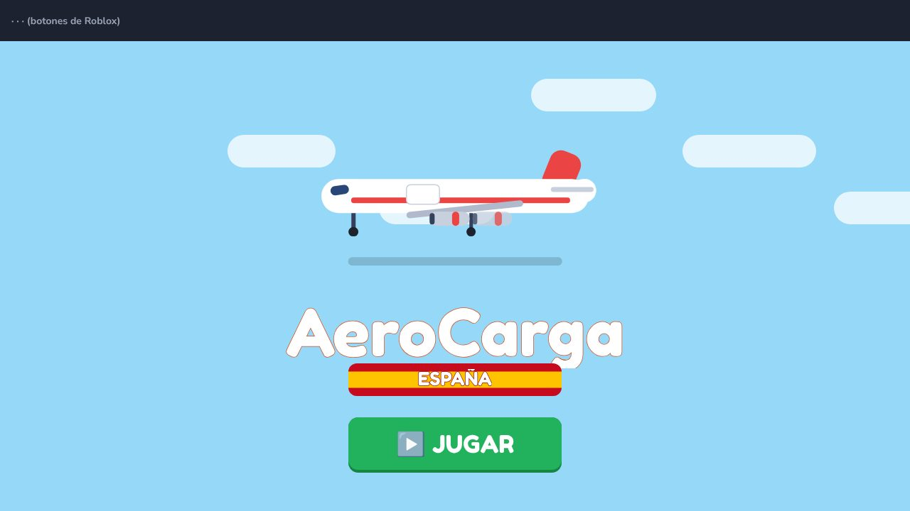

# AeroCarga España (Roblox) — guía rápida

Juego 2D de aerolínea de carga por España. Diseño completo en [DISENO.md](DISENO.md).
**No hay que subir ninguna imagen**: el mapa, los aviones y los iconos (emojis) se dibujan con código.



## Probarlo en Roblox Studio (clic a clic)

1. **Descarga el lugar:**
   https://github.com/candhu23/mi-priemra-web/raw/claude/zealous-dirac-ejfljx/roblox-carga-aerea/AeroCarga.rbxl
2. Ábrelo con doble clic (se abre en Roblox Studio).
3. Pulsa **Play** (▶). Debe salir la pantalla azul con **AeroCarga · ESPAÑA** y el botón **JUGAR**.
4. Si en vez del mapa ves «Conectando con el servidor…» durante más de 10 segundos:
   **View → Output** y mándame captura de las líneas en **rojo**.

> Sin publicar, el juego **funciona pero no guarda la partida** (sale un aviso). Es normal.

## Publicarlo como juego NUEVO (no reemplaces Web Empire Tycoon)

1. Con `AeroCarga.rbxl` abierto: **File → Publish to Roblox As…**
2. Elige **Create new experience** (experiencia nueva). **No elijas Web Empire Tycoon.**
3. Nombre recomendado: **AeroCarga España ✈️** · Descripción: la del final de esta guía → **Create**.
4. Para que guarde: **Home → Game Settings → Security → activa «Enable Studio Access to API Services» → Save**.

## Crear los artículos de la tienda (cuando quieras ganar Robux)

1. Entra en **create.roblox.com → Creations → AeroCarga España → Monetization**.
2. **Passes → Create a Pass**: crea los 4 pases (nombre, imagen y precio de la tabla de `DISENO.md` §6) y pon cada uno **On Sale**.
3. **Developer Products → Create**: crea los 10 productos de la tabla.
4. Copia el **ID** de cada uno (número largo) y pásamelos indicando cuál es cuál. Yo los pongo en el código.

## Descripción para la página del juego (puedes copiarla)

> ✈️ ¡Crea tu aerolínea de carga y conquista España! Lleva naranjas de Valencia, jamón de Salamanca,
> vino de La Rioja o plátanos de Canarias. Compra aviones, ficha pilotos, completa contratos exprés
> y pinta el mapa de España con tus colores. ¡Juega con amigos y gana más!
>
> ✈️ Build your cargo airline and conquer Spain! Deliver local products, buy planes, hire pilots,
> complete express contracts and paint the map of Spain with your colours. Play with friends for bonus cash!

## Cómo está hecho (para Claude)

```
roblox-carga-aerea/
├── default.project.json        # Rojo. Players.CharacterAutoLoads = false (juego 2D, sin personaje)
├── AeroCarga.rbxl              # Lugar generado por tools/check.sh (lo que se publica)
├── DISENO.md · README.md · docs/ (capturas de la vista previa)
├── src/
│   ├── ReplicatedStorage/
│   │   ├── Config.luau         # TODOS los datos y fórmulas (aeropuertos, aviones, tienda…)
│   │   ├── Lang.luau           # Textos EN/ES (el servidor manda claves, el cliente traduce)
│   │   └── MapData.luau        # GENERADO por tools/assets/build_spain.py (mapa en franjas)
│   ├── ServerScriptService/
│   │   ├── GameServer.server.luau   # Remotes, entrada/salida, estado, bucle
│   │   └── Cargo/ Data.luau (guardado, todo en pcall) · Game.luau (lógica) · Shop.luau (Robux)
│   └── StarterPlayerScripts/
│       ├── GameClient.client.luau   # Arranque de la interfaz
│       └── UI/ Kit · PlaneArt · MapView · Hud · Screens · *Panel
└── tools/
    ├── check.sh                # Verificación completa + .rbxl (OBLIGATORIO antes de commit)
    ├── assets/build_spain.py   # Regenera MapData.luau desde Natural Earth
    └── harness/                # mock.luau, run_server.luau, run_game.luau, check_lang.py, preview.py
```
