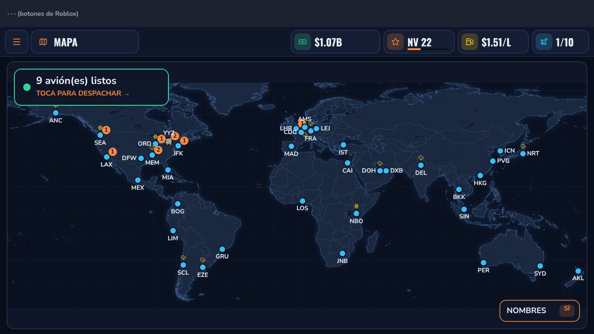

# Air Cargo Empire (Roblox) — guía rápida

Juego de gestión de una aerolínea de carga, casi todo interfaz. Diseño completo en [DISENO.md](DISENO.md).



## Cómo probarlo en Roblox Studio

1. **Descarga el lugar:**
   https://github.com/candhu23/mi-priemra-web/raw/claude/zealous-dirac-ejfljx/roblox-carga-aerea/AirCargo.rbxl
2. Ábrelo con **Roblox Studio** (doble clic en el archivo).
3. Pulsa **Play** (▶). Verás la interfaz con *sustitutos* de iconos y mapa (aún no hay imágenes subidas).
4. Para que **guarde la partida** al probar: **File → Game Settings → Security →
   Enable Studio Access to API Services → Save**. (Solo funciona después de publicarlo, ver abajo.)

## Publicarlo como juego NUEVO (no reemplaces Web Empire Tycoon)

1. En Studio con `AirCargo.rbxl` abierto: **File → Publish to Roblox As…**
2. Elige **Create new experience** (crear experiencia nueva). **No elijas Web Empire Tycoon.**
3. Nombre: *Air Cargo Empire* (o el que quieras) → **Create**.

## Subir las 4 imágenes (iconos, aviones y mapa)

1. Descarga las 4 imágenes de la carpeta `assets/`:
   - https://github.com/candhu23/mi-priemra-web/raw/claude/zealous-dirac-ejfljx/roblox-carga-aerea/assets/iconos.png
   - https://github.com/candhu23/mi-priemra-web/raw/claude/zealous-dirac-ejfljx/roblox-carga-aerea/assets/aviones.png
   - https://github.com/candhu23/mi-priemra-web/raw/claude/zealous-dirac-ejfljx/roblox-carga-aerea/assets/mapa_oeste.png
   - https://github.com/candhu23/mi-priemra-web/raw/claude/zealous-dirac-ejfljx/roblox-carga-aerea/assets/mapa_este.png
2. En Studio (con el juego ya publicado): **View → Asset Manager**.
3. Botón **Bulk Import** (icono de nube con flecha) → selecciona las 4 imágenes → **Abrir**.
4. Espera a que pasen la moderación (puede tardar unos minutos; mientras, salen en gris).
5. En la carpeta **Images** del Asset Manager: **clic derecho en cada imagen → Copy ID to Clipboard**
   y pégame los 4 números diciendo cuál es cuál. Yo los pongo en el código y te paso el `.rbxl` nuevo.

## Cómo está hecho (para Claude)

```
roblox-carga-aerea/
├── default.project.json      # Rojo. Players.CharacterAutoLoads = false (juego solo de interfaz)
├── AirCargo.rbxl             # Lugar generado con tools/check.sh
├── DISENO.md                 # Documento de diseño
├── assets/                   # PNG para subir a Roblox + LICENCIAS.md
├── docs/                     # Capturas de la vista previa aproximada
├── src/
│   ├── ReplicatedStorage/Config.luau   # TODOS los datos y fórmulas (+ Config.Assets con los IDs)
│   ├── ReplicatedStorage/Lang.luau     # Textos en inglés y español
│   ├── ServerScriptService/GameServer.server.luau
│   └── StarterPlayerScripts/GameClient.client.luau  # Toda la interfaz
└── tools/
    ├── check.sh              # Verificación completa + rojo build (OBLIGATORIO antes de commit)
    ├── assets/               # Scripts que generan los PNG (build_icons.js, build_planes.js, build_map.py)
    └── harness/              # run_server / run_client (Lune) + preview.py (vista previa en Chromium)
```
